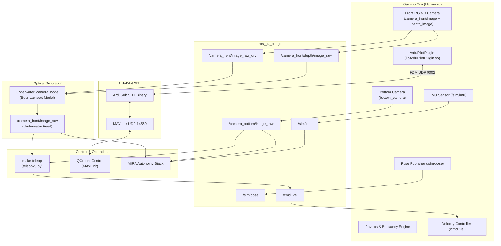

# Mira Simulator

A realistic underwater robotics simulator for the **BlueROV2 Heavy** based on **Gazebo Harmonic**, **ROS 2 Jazzy**, and **ArduPilot SITL (ArduSub)**.


> 📘 **Looking for detailed commands, competition bringup, and topic definitions?** Check out the [Complete Usage Guide (USAGE.md)](./USAGE.md).

---

## Overview

Mira Simulator provides an end-to-end underwater simulation pipeline for autonomous underwater vehicle (AUV) competition tasks (SAUVC and TACC). It automatically leverages **host system Gazebo Harmonic** for maximum rendering performance, while seamlessly falling back to **Docker** if system Gazebo is not installed.

### Key Features
- **Real-time 3D physics & hydrodynamics** for the 8-thruster BlueROV2 Heavy.
- **Physical optical underwater modeling** via `underwater_camera_node` (Beer-Lambert attenuation & light scattering based on depth buffer).
- **SAUVC 2026 Competition Arenas**: Instant switching between Qualification (`ARENA=quali`) and Finals (`ARENA=finals`) with randomized props.
- **Interactive Keyboard Teleoperation**: Driven via `make teleop` with instant speed control, zero-velocity braking, and camera recording.
- **Bi-directional ROS 2 Jazzy Bridge**: Bridges dry/depth camera streams, IMU, ground-truth pose, and `/cmd_vel` velocity commands.
- **MAVLink / ArduSub SITL**: Out-of-the-box telemetry on UDP `14550` for QGroundControl or autonomous mission control.

---

## Architecture & Data Flow



---

## Installation & Requirements

### System Requirements
- **Ubuntu 24.04 (Noble)** or **Ubuntu 22.04 (Jammy)**
- **ROS 2 Jazzy Jalisco**
- **Gazebo Harmonic**
- **Docker & Docker Compose** (v2.0+)
- **Python 3.12**, `uv`, `ninja-build`, `lld`
- Optional: **NVIDIA GPU + NVIDIA Container Toolkit** (auto-detected)

### Installing Host Gazebo & ROS 2 Dependencies

To run Gazebo directly on your host with hardware acceleration:

```bash
# 1. Add ROS 2 Jazzy repository
sudo apt update && sudo apt install -y software-properties-common curl
sudo curl -sSL https://raw.githubusercontent.com/ros/rosdistro/master/ros.key -o /usr/share/keyrings/ros-archive-keyring.gpg
echo "deb [arch=$(dpkg --print-architecture) signed-by=/usr/share/keyrings/ros-archive-keyring.gpg] http://packages.ros.org/ros2/ubuntu $(. /etc/os-release && echo $UBUNTU_CODENAME) main" | sudo tee /etc/apt/sources.list.d/ros2.list > /dev/null

# 2. Install ROS 2 Jazzy, Gazebo Harmonic, and bridge packages
sudo apt update
sudo apt install -y \
  ros-jazzy-desktop \
  ros-jazzy-ros-gz \
  ros-jazzy-ros-gz-bridge \
  ros-jazzy-ros-gz-sim \
  ros-jazzy-ros-gz-interfaces \
  ros-jazzy-cv-bridge \
  ros-jazzy-image-transport \
  tmux \
  ninja-build \
  lld

# 3. Install uv tool
curl -LsSf https://astral.sh/uv/install.sh | sh
```

### Building the Workspace

```bash
# Clone repository and submodules
git clone <repo-url> mira_sim && cd mira_sim
git submodule update --init --recursive

# Build workspace packages
source /opt/ros/jazzy/setup.bash
colcon build --symlink-install --cmake-args -DCMAKE_EXPORT_COMPILE_COMMANDS=ON
```

---

## Quick Start

### 1. Launch SAUVC Simulation (Tmux Bringup)

```bash
# Finals arena (default)
make bringup-sauvc

# Qualification arena
make bringup-sauvc ARENA=quali
```

This brings up:
- **Window 0 (`sitl`)**: ArduPilot SITL container
- **Window 1 (`bridge`)**: `ros_gz_bridge` and `underwater_camera_node` log stream
- **Window 2 (`gazebo`)**: Gazebo Harmonic 3D simulation with water arena & BlueROV2

### 2. Drive the Vehicle (Keyboard Teleop)

In a new terminal:
```bash
make teleop
```

Control keys:
- **`w` / `s`**: Forward / Backward
- **`a` / `d`**: Strafe Left / Right
- **`r` / `f`**: Up / Down (Thrust)
- **`q` / `e`**: Yaw Left / Right
- **`SPACE`**: Instant zero-velocity stop
- **`1` / `2` / `0`**: Toggle Front / Bottom / All camera video recordings
- **`i` / `k` / `j` / `l`**: Adjust linear / angular speeds

### 3. Clean Shutdown

```bash
make bringdown
```

---

## Standalone Simulator Targets

```bash
make simulator-sauvc-gz ARENA=finals  # Direct Gazebo SAUVC Finals arena
make simulator-sauvc-gz ARENA=quali   # Direct Gazebo SAUVC Qualification arena
make simulator-tacc-gz                # Direct Gazebo TACC pipeline arena
make sitl                             # Standalone ArduPilot SITL container
make shell                            # Interactive bash inside Gazebo container
```

---

## Further Documentation

- 📘 [USAGE.md](./USAGE.md) — In-depth guide: architecture, arena configs, optical pipeline, and topic reference
- 🔧 [docs/TROUBLESHOOTING.md](./docs/TROUBLESHOOTING.md) — Detailed debugging guide (X11 display, GPU, QGroundControl)
- 📝 [GAZEBO_NOTES.md](./GAZEBO_NOTES.md) — Technical notes on Gazebo Harmonic migration and plugin integration
- 🌐 [ArduSub Manual](https://www.ardusub.com) — ArduSub autopilot documentation

---

## License

Apache License 2.0. See [LICENSE](./LICENSE).
