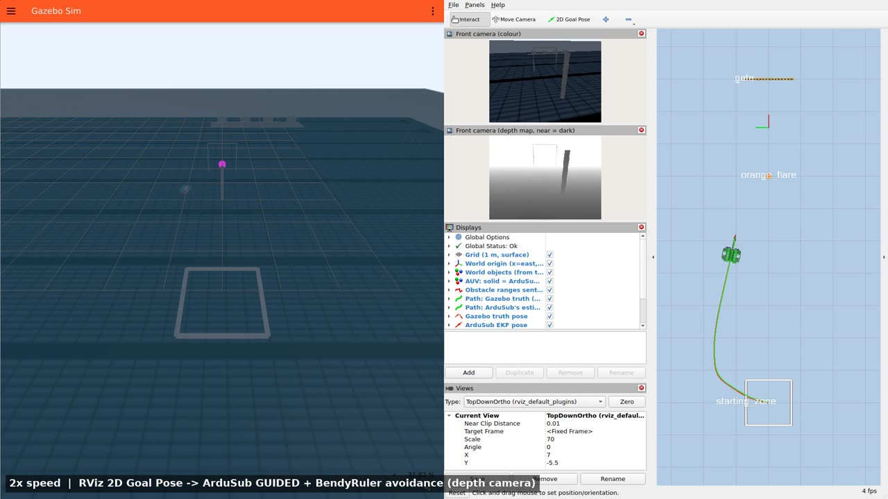

# Mira Simulator

A fully containerized underwater robotics simulator for the BlueROV2 based on **Gazebo Harmonic** and **ArduPilot SITL**.


## Overview

Mira combines Gazebo Harmonic, ArduPilot SITL, and the BlueROV2 model into a complete simulation environment. Everything runs in Docker—no ROS installation needed on your host.

**Key Features:**
- Real-time 3D physics with multiple underwater worlds
- MAVLink integration with QGroundControl
- Auto-detected GPU rendering (NVIDIA/Intel iGPU/software fallback)
- Persistent containers for interrupted session recovery

## Requirements

- **Docker & Docker Compose** (v2.0+)
- **X11 server** (for GUI; use `ssh -X` if remote)
- **4+ CPU cores, 8GB RAM** minimum
- **Linux** (tested on Ubuntu 22.04+)
- Optional: **QGroundControl** (download from [qgroundcontrol.com](https://qgroundcontrol.com))
- Optional: **NVIDIA GPU + NVIDIA Container Toolkit** (auto-detected if present)

## Quick Start

```bash
# Clone and initialize submodules
git clone <repo-url> && cd mira_sim
git submodule update --init --recursive

# Terminal 1: Start ArduPilot SITL (autopilot)
make sitl

# Terminal 2: Start Gazebo simulator
make simulator-tacc-gz

# Terminal 3: Launch QGroundControl on your host
qgroundcontrol  # or download from qgroundcontrol.com
```

**That's it!** QGC auto-connects to the simulator on `127.0.0.1:14550` (UDP).

## Available Worlds

```bash
make simulator-tacc-gz   # TACC pipeline world
make simulator-sauvc-gz  # SAUVC competition world
```

## Container Management

```bash
# Restart containers (surviving Ctrl-C)
make shell              # Attach shell to Gazebo container
docker compose stop     # Stop all services
docker compose down     # Stop and remove containers
docker compose build    # Rebuild images locally
```

**Services:**
- `ardupilot-sitl` — Autopilot (listening on 14550/UDP)
- `mira_sim` — Gazebo simulator (auto-detects GPU)
- `mira-sim-gpu` — Explicit NVIDIA GPU variant

Force GPU selection:
```bash
MIRA_GPU=1 make simulator-tacc-gz    # Force NVIDIA
MIRA_GPU=0 make simulator-tacc-gz    # Force software rendering
```

## Competition Bringup

Tmux sessions with persistent containers:

```bash
make bringup-tacc    # TACC world
make bringup-sauvc   # SAUVC world (with ros_gz_bridge)
make bringdown       # Stop all bringup containers (-t 0)

# Skip ArduPilot SITL container:
NO_ARDUPILOT=1 make bringup-tacc
NO_ARDUPILOT=1 make bringup-sauvc

tmux attach -t mira-tacc    # Attach to session
tmux kill-session -t mira-tacc  # Kill session
```

## Vision Navigation (GPS-free)

ArduSub with GPS disabled, localised from the front RGB-D camera (RTAB-Map visual odometry), flying GUIDED waypoints. Needs a locally built Gazebo image and an NVIDIA GPU for a usable camera rate.

[](./docs/media/vision_nav_demo.mp4)

*[Demo video](./docs/media/vision_nav_demo.mp4) (2x speed): a "2D Goal Pose" dragged in RViz sends ArduSub to the SAUVC gate; BendyRuler steers it around the orange flare using the depth camera. Recorded with `make record-demo` on software rendering, with Gazebo ground truth as the position source (`VISION_SOURCE=gt`).*

```bash
docker compose build mira-sim-gpu          # adds rtabmap + pymavlink + rviz2
make bringup-vision                        # SAUVC pool, VO-driven ArduSub + RViz: "2D Goal Pose" sends it there
make bringup-vision VISION_MAP=tacc        # same on the TACC world
make waypoints                             # fly the map's tour (src/vision_nav/waypoints/sauvc_tour.yaml)
make compare-odom                          # VO drift vs ground truth
make bringup-vision VISION_SOURCE=gt       # debug only: Gazebo truth instead of VO
make record-demo                           # video: Gazebo + RViz, 2D Goal Pose, avoidance
```

Details, frames and tuning: [docs/VISION_NAV.md](./docs/VISION_NAV.md).

## Troubleshooting

For detailed troubleshooting steps (X11 issues, QGC connection, performance tuning, etc.), see [docs/TROUBLESHOOTING.md](./docs/TROUBLESHOOTING.md).

## Structure

```
mira_sim/
├── docker-compose.yml            # Service definitions
├── docker/                        # Dockerfiles & startup scripts
├── worlds/                        # Custom Gazebo world files
├── ardupilot/                     # SITL config directory
├── src/
│   ├── bluerov2_gz/              # BlueROV2 model (submodule)
│   ├── ardupilot_gazebo/         # FDM bridge (submodule)
│   ├── vision_nav/               # RGB-D VO -> ArduSub bridge, waypoints
│   └── sauvc_sim/                # SAUVC models (submodule)
├── Makefile
├── GAZEBO_NOTES.md               # Technical integration notes
└── docs/
    └── TROUBLESHOOTING.md        # Detailed debugging guide
```

## Building Locally

Rebuild Docker images after editing code:

```bash
docker compose build
docker compose up --build --no-recreate -d
```

First build takes 30-45 minutes (ArduPilot compilation).

## Learn More

- [GAZEBO_NOTES.md](./GAZEBO_NOTES.md) — Technical background on Gazebo Harmonic migration & known fixes
- [docs/TROUBLESHOOTING.md](./docs/TROUBLESHOOTING.md) — Debugging guide
- [Gazebo Docs](https://gazebosim.org)
- [ArduPilot Docs](https://ardupilot.org)
- [ArduSub Manual](https://www.ardusub.com)

## License

Apache License 2.0. See [LICENSE](./LICENSE).
