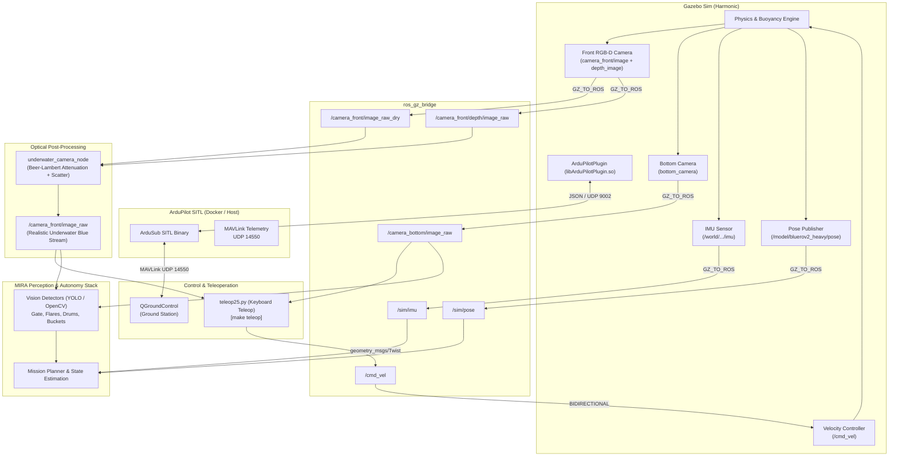

# MIRA Simulator: Complete Usage Guide

`mira_sim` is an autonomous underwater vehicle (AUV) simulation platform for the **BlueROV2 Heavy** configuration, developed for the Singapore Autonomous Underwater Vehicle Challenge (**SAUVC**) and Trans-Atlantic Autonomous Catch Challenge (**TACC**).

It couples **Gazebo Harmonic**, **ROS 2 Jazzy**, and **ArduPilot SITL (ArduSub)** with a physical underwater optical rendering pipeline.

---

## Architecture & Data Flow



### Text Data Flow Overview

```
[Gazebo RGB-D]  ──────> [ros_gz_bridge] ──────> /camera_front/image_raw_dry  ──┐
[Gazebo Depth]  ──────> [ros_gz_bridge] ──────> /camera_front/depth/image_raw ─┴─> [underwater_camera_node]
                                                                                            │
                                                                                            ▼
                                                                                /camera_front/image_raw
                                                                                (Realistic Underwater Feed)
                                                                                            │
                                        ┌───────────────────────────────────────────────────┴───────┐
                                        ▼                                                           ▼
                                  [make teleop]                                         [MIRA Perception Stack]
                             (teleop25.py Keyboard)                                  (YOLO / Aruco / Detection)
                                        │
                                        ▼ /cmd_vel (Twist)
                                 [ros_gz_bridge]
                                        │
                                        ▼ /cmd_vel
                                 [Gazebo Vehicle]
```

---

## Prerequisites & Installation

### 1. Host Requirements
- **Ubuntu 24.04 LTS (Noble)** or **Ubuntu 22.04 LTS (Jammy)**
- **ROS 2 Jazzy Jalisco**
- **Gazebo Harmonic**
- **Docker & Docker Compose v2.0+**
- Python 3.12, `uv`, `ninja-build`, `lld`

### 2. Install ROS 2 Jazzy & Gazebo Harmonic

If not already installed on your host:

```bash
# Add ROS 2 Jazzy repository
sudo apt update && sudo apt install -y software-properties-common curl
sudo curl -sSL https://raw.githubusercontent.com/ros/rosdistro/master/ros.key -o /usr/share/keyrings/ros-archive-keyring.gpg
echo "deb [arch=$(dpkg --print-architecture) signed-by=/usr/share/keyrings/ros-archive-keyring.gpg] http://packages.ros.org/ros2/ubuntu $(. /etc/os-release && echo $UBUNTU_CODENAME) main" | sudo tee /etc/apt/sources.list.d/ros2.list > /dev/null

# Install ROS 2 Jazzy Desktop and Gazebo Harmonic bridge packages
sudo apt update
sudo apt install -y \
  ros-jazzy-desktop \
  ros-jazzy-ros-gz \
  ros-jazzy-ros-gz-bridge \
  ros-jazzy-ros-gz-sim \
  ros-jazzy-ros-gz-interfaces \
  ros-jazzy-cv-bridge \
  ros-jazzy-image-transport \
  tmux \
  ninja-build \
  lld

# Install uv for Python toolchain management
curl -LsSf https://astral.sh/uv/install.sh | sh
```

### 3. Clone and Build Workspace

```bash
git clone <repo-url> mira_sim
cd mira_sim

# Initialize and pull all submodules
git submodule update --init --recursive

# Build workspace packages
source /opt/ros/jazzy/setup.bash
colcon build --symlink-install --cmake-args -DCMAKE_EXPORT_COMPILE_COMMANDS=ON
```

---

## Daily Operations & Commands

### 1. Bringup Competition Environment

The primary workflow uses `make bringup-sauvc`. This automatically opens a 3-window `tmux` session (`mira-sauvc`):
- **Window 0 (`sitl`)**: ArduPilot SITL container running ArduSub (MAVLink UDP on `14550`)
- **Window 1 (`bridge`)**: `ros_gz_bridge` and `underwater_camera_node` log stream
- **Window 2 (`gazebo`)**: Gazebo Harmonic running the arena world with BlueROV2 Heavy

#### Finals Arena (Default)
Spawns the complete finals course: starting zone, navigation gate, orange flare, 3 randomized colored flares (red, yellow, blue), and 4 target drums (1 blue, 3 red):
```bash
make bringup-sauvc
# or explicitly:
make bringup-sauvc ARENA=finals
```

#### Qualification Arena
Spawns qualification starting lines and qualification gate:
```bash
make bringup-sauvc ARENA=quali
```

#### Bringup Options & Environment Variables
| Variable | Values | Description |
|---|---|---|
| `ARENA` | `finals` (default), `quali` | Chooses between Finals and Qualification pool setups |
| `NO_ARDUPILOT` | `0` (default), `1` | Set `NO_ARDUPILOT=1` to skip ArduPilot SITL (for pure `/cmd_vel` testing) |
| `USE_SYSTEM_GZ` | `1` (default), `0` | Set `USE_SYSTEM_GZ=0` to force running Gazebo inside Docker |
| `MIRA_GPU` | `auto`, `1`, `0` | `1` forces NVIDIA GPU container; `0` forces software rendering |

#### Attach and Detach from Bringup Session
```bash
# Attach to active bringup session
tmux attach -t mira-sauvc

# Detach from tmux session without stopping:
# Press: Ctrl-b then d
```

#### Clean Teardown
```bash
# Safely terminates all Gazebo, bridge, camera node, SITL, and tmux processes
make bringdown
```

---

## Teleoperation

Drive the simulated BlueROV2 in real time with keyboard controls:

```bash
make teleop
```

When started, `teleop25` outputs the interactive control scheme:

```text
╔══════════════════════════════════════════════════════════════╗
║               MIRA AUV Teleoperation Controls                ║
╠══════════════════════════════════════════════════════════════╣
║  Movement:                                                   ║
║     w / s : Forward / Backward                               ║
║     a / d : Strafe Left / Right                              ║
║     r / f : Up / Down (Thrust)                               ║
║     q / e : Yaw Left / Right                                 ║
║                                                              ║
║  Speed Tuning:                                               ║
║     i / k : Increase / Decrease Linear Speed (±0.1 m/s)      ║
║     j / l : Increase / Decrease Angular Speed (±0.1 rad/s)   ║
║                                                              ║
║  Camera Feeds & Recording:                                   ║
║     1     : Toggle Front Camera recording                    ║
║     2     : Toggle Bottom Camera recording                   ║
║     0     : Start / Stop ALL Camera recordings               ║
║                                                              ║
║  Safety & Exit:                                              ║
║     SPACE : STOP (Zero all velocities immediately)           ║
║     CTRL-C: Exit teleoperation                               ║
╚══════════════════════════════════════════════════════════════╝
```

> [!TIP]
> Pressing `SPACE` immediately publishes zero velocity on `/cmd_vel` to brake the vehicle.

For testing with a physical joystick or gamepad:
```bash
make teleop-joy
```

---

## ROS 2 Topic Dictionary

| ROS 2 Topic | Message Type | Source Node | Consumer | Description |
|---|---|---|---|---|
| `/camera_front/image_raw` | `sensor_msgs/msg/Image` | `underwater_camera_node` | Perception, Teleop | Realistic blue underwater camera stream |
| `/camera_front/image_raw_dry` | `sensor_msgs/msg/Image` | `ros_gz_bridge` | `underwater_camera_node` | Raw dry render from Gazebo |
| `/camera_front/depth/image_raw` | `sensor_msgs/msg/Image` | `ros_gz_bridge` | `underwater_camera_node` | 32FC1 depth buffer from Gazebo |
| `/camera_front/camera_info` | `sensor_msgs/msg/CameraInfo` | `ros_gz_bridge` | Perception | Front camera intrinsics |
| `/camera_bottom/image_raw` | `sensor_msgs/msg/Image` | `ros_gz_bridge` | Perception, Teleop | Downward-facing camera stream |
| `/camera_bottom/camera_info`| `sensor_msgs/msg/CameraInfo` | `ros_gz_bridge` | Perception | Bottom camera intrinsics |
| `/cmd_vel` | `geometry_msgs/msg/Twist` | `teleop25` / Autonomy | Gazebo vehicle | Linear and angular velocity setpoints |
| `/sim/imu` | `sensor_msgs/msg/Imu` | `ros_gz_bridge` | Navigation | Vehicle IMU acceleration and gyro rates |
| `/sim/pose` | `geometry_msgs/msg/PoseStamped` | `ros_gz_bridge` | Navigation / Evaluation | Ground truth vehicle position in pool |
| `/world/water_world/create` | `ros_gz_interfaces/srv/SpawnEntity` | `ros_gz_bridge` | Entity Spawner | Gazebo world entity spawning service |

---

## Optical Simulation Details

Ignition/Gazebo Harmonic's Ogre 2 rendering engine lacks per-scene underwater volume absorption out of the box. `mira_sim` implements direct physical water column attenuation using an aligned depth buffer via `underwater_camera_node`:

$$I_c = J_c \cdot e^{-\beta_c \cdot z} + B_c \cdot (1 - e^{-\beta_c \cdot z})$$

- $J_c$: Dry rendered pixel intensity
- $z$: Distance to the object in metres (derived from the aligned depth buffer)
- $\beta_c$: Wavelength-dependent attenuation coefficient ($[0.22, 0.05, 0.03]\text{ m}^{-1}$ for red, green, blue)
- $B_c$: Veiling backscatter light ($[0.02, 0.30, 0.72]$)

Red attenuates $\approx 7\times$ faster than blue in water, accurately replicating competition camera conditions where red drums appear dark and distant objects blend into the water haze.
